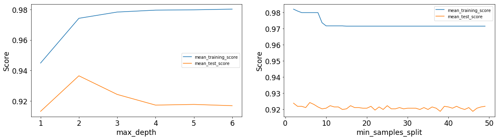
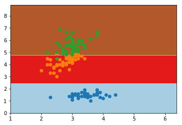

# AMLModules
- **GridSearchPerformancePlot** - Plots the score vs param\_values plot using the GridSearchCV object
    
- **VisualizeDecisionBoundary** - Plots the decision boundary and the scatter plot of data points on the same graph
    
